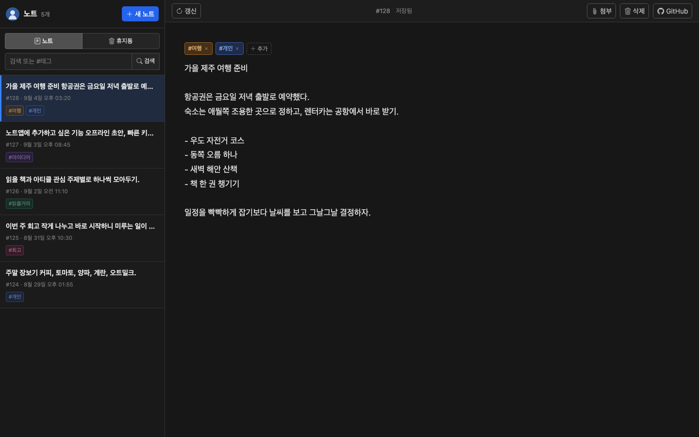

# Issue Note

개인용으로 사용하기 좋은 심플하고 안전한 노트 앱입니다. GitHub Issues를
노트 앱처럼 사용할 수 있도록 인터페이스만 제공하며, 자체 데이터베이스는
사용하지 않습니다.

**서비스 주소(누구나 바로 사용 가능):** [note.gitools.net](https://note.gitools.net)

기능 요청사항이 있는 경우 포크해서 직접 변경하세요. 제가 쓰기에는 이미 충분해서
별도의 기능 제안은 받지 않습니다.

## 화면

### 데스크톱



## 시작하기

```bash
npm install
npm run dev
```

GitHub에서 fine-grained personal access token을 만들고 다음 권한만 부여하세요.

- Repository access: 노트 저장소 하나
- Issues: Read and write
- Metadata: Read
- Contents: Read and write (파일·클립보드 이미지 첨부를 사용할 때만)

PAT와 저장소 설정은 사용자의 브라우저에만 저장되며, API 요청은 브라우저에서
`api.github.com`으로 직접 전송됩니다.

## 첨부파일 저장 방식

첨부파일은 GitHub Issue 자체에 바이너리로 저장되지 않습니다. 실제 파일은 같은
저장소의 다음 경로에 저장됩니다.

```text
.issue-note-assets/issues/{이슈 번호}/{UUID}-{파일명}
```

파일 하나마다 해당 이슈에 전용 댓글 하나를 만들며, 댓글에는 이미지 미리보기
또는 파일 링크와 앱이 사용하는 메타데이터 마커가 들어갑니다.

```md


<!-- issue-note-attachment:... -->
```

따라서 앱에서는 첨부파일을 본문 위의 썸네일 목록과 이미지 뷰어로 볼 수 있고,
GitHub 이슈 페이지에서도 이미지 또는 파일 링크를 바로 확인할 수 있습니다.
이슈 본문에는 첨부 메타데이터를 섞지 않고 순수한 노트 내용만 저장합니다.

첨부 작업은 다음 순서로 처리됩니다.

- 추가: 저장소에 파일 생성 → 첨부 댓글 생성
- 댓글 생성 실패: 방금 만든 저장소 파일 삭제
- 삭제: 저장소 파일 삭제 → 연결된 첨부 댓글 삭제
- 복구: 이슈를 열 때 그 이슈의 파일 폴더와 첨부 댓글만 대조하여, 댓글 없는
  파일은 전용 댓글을 다시 만들고 파일 없는 전용 댓글은 제거

다른 이슈나 저장소 전체를 스캔하지 않습니다. 일반 댓글이 많아도 첨부 댓글을
누락하지 않도록 GitHub의 페이지 링크를 마지막까지 따라간 뒤 대조합니다. 첨부는
노트당 최대 30개, 파일 하나당 10MB로 제한합니다. 첨부 기능을 사용하려면 PAT에
Issues와 Contents의 Read and write 권한이 모두 필요합니다. `.issue-note-assets/`의 파일이나
`<!-- issue-note-attachment:... -->` 마커가 있는 댓글을 GitHub에서 직접 수정하면
앱의 첨부 연결이 깨질 수 있습니다.

편집 내용은 1초 간격으로 브라우저의 로컬 초안에 저장되고, 마지막 입력 후
5초가 지나면 GitHub Issue에 자동 저장됩니다. 자동 저장 대기 시간은 환경설정에서
3~30초로 바꿀 수 있습니다. 기본 설정에서는 본문의 첫 줄을
trim한 뒤 앞 50자를 이슈 제목으로 사용합니다. 연결 설정에서 별도 제목 입력,
글꼴, 글자 크기와 줄간격을 변경할 수 있습니다.

GitHub 라벨은 별도 접두어 없이 노트의 태그로 사용합니다. 편집기에서 태그를
추가하거나 제거할 수 있습니다. 태그 추가 메뉴에서는 기존 라벨을 검색해 바로
적용하거나 새 태그를 만들 수 있습니다. 목록의 태그를 누르면 해당 라벨이 붙은
노트만 볼 수 있습니다. 앱에서 새로 만드는 태그의 색상은 이름의 Unicode
코드포인트로 계산하므로 이름마다 색상환 전체에 분산되고, 같은 이름은 항상 같은
색상을 사용합니다. GitHub에서 직접 만든 기존 라벨의 색상은 변경하지 않습니다.

목록은 최근 업데이트 순으로 30개씩 불러오며, 아래의 **더 보기** 버튼으로 다음
페이지를 이어서 불러옵니다. 현재 표시 중인 목록은 한 시간마다 백그라운드에서
다시 확인하여 새 이슈를 반영합니다. 목록에서 노트를 선택하면 현재 데이터로
본문을 즉시 표시한 뒤 그 이슈 하나만 백그라운드에서 다시 읽습니다. 로컬에 아직
저장되지 않은 편집 내용이 있거나 요청 도중 입력이 시작되면 원격 응답으로 본문을
덮어쓰지 않습니다.

별도 제목을 사용하지 않을 때 목록 미리보기는 본문의 첫 줄에서 Markdown 문법을
제거한 뒤 최대 50자까지만 표시합니다. 편집기에서 커서가 Markdown 링크 또는
일반 HTTP(S) 주소 위에 있으면 축약된 링크가 나타나며, 누르면 새 탭 또는 데스크톱
기본 브라우저로 엽니다.

GitHub API는 이슈 자체를 삭제하는 기능을 제공하지 않으므로 앱의 휴지통은 닫힌
이슈(`closed`)를 뜻합니다. 휴지통에는 닫힌 지 30일 이내인 노트만 표시되며,
30일이 지난 이슈도 저장소에서 삭제되지는 않습니다. 오래된 이슈는 GitHub에서
직접 확인할 수 있습니다.

## PWA

프로덕션 빌드는 설치 가능한 PWA로 동작합니다. 매니페스트와 서비스 워커는 특정
도메인이나 호스팅 서비스에 종속되지 않으며, 앱이 배포된 상대 경로를 기준으로
동작합니다. 서비스 워커는 앱과 같은 출처의 정적 파일만 캐시하고 GitHub API
요청, PAT, 노트 데이터는 캐시하지 않습니다.

## 데스크톱 앱

Tauri 2 래퍼는 프로덕션 `dist/`를 실행 파일에 포함합니다. 데스크톱 앱도 별도
앱 서버를 사용하지 않고 GitHub API에 직접 연결합니다.

Rust와 플랫폼별 [Tauri 사전 요구 사항](https://v2.tauri.app/start/prerequisites/)을
설치한 뒤 로컬에서 실행하거나 패키징할 수 있습니다.

```bash
npm run tauri:dev
npm run tauri:build
```

`main`에 푸시할 때마다 GitHub Releases 바이너리를 자동으로 빌드합니다. 버전은
GitHub Actions 실행 번호를 패치 버전에 넣은 `0.1.<run_number>` 형식이며, 워크플로
안에서 루트 `package.json`에 주입되므로 데스크톱 번들에도 같은 버전이 기록됩니다.
자동 버전 변경은 빌드 러너 안에서만 이루어져 다시 커밋되거나 연쇄 빌드를 만들지
않습니다. 필요하면 Actions 화면에서 Desktop release 워크플로를 수동 실행할 수도
있습니다.

릴리스 워크플로는 macOS universal, Windows, Linux 설치 파일을 만들어 GitHub의
Releases 탭에 게시합니다. 현재 macOS 빌드는 ad-hoc 서명만 적용되며 공증되지
않고, Windows 빌드도 신뢰할 수 있는 게시자 인증서로 서명되지 않습니다. 따라서
다운로드한 사용자의 운영체제가 최초 실행 경고를 표시할 수 있습니다.

## 빌드

```bash
npm run build
```

`dist/` 폴더를 GitHub Pages나 다른 정적 호스팅에 배포할 수 있습니다.

## 테스트

```bash
npm test
```

개발 중에 테스트를 계속 실행하려면 `npm run test:watch`, Svelte 정적
검사는 `npm run check`를 사용합니다. `main` 푸시와 pull request에서는 GitHub
Actions가 정적 검사, 테스트, 빌드를 자동으로 실행합니다.

## 개발 및 유지보수

이 저장소는 별도의 `AGENTS.md`를 운영하지 않습니다. 구현을 변경할 때 필요한
프로젝트 규약과 데이터 호환성 정보는 이 README를 기준으로 합니다.

### 개발 환경과 명령어

CI는 Node.js 22와 `npm ci`를 사용합니다. 의존성을 바꿀 때는 `package.json`과
`package-lock.json`을 함께 커밋하세요.

```bash
npm ci              # 잠금 파일 기준 설치
npm run dev         # 개발 서버
npm run check       # Svelte 정적 검사
npm test            # Vitest 전체 테스트
npm run test:watch  # 변경 감지 테스트
npm run build       # dist/ 프로덕션 빌드
npm run preview     # 빌드 결과 확인
```

변경을 마치기 전에는 최소한 다음 명령을 모두 통과시켜야 합니다.

```bash
npm run check
npm test
npm run build
```

`main` 브랜치 푸시와 pull request에서도 같은 검사를 GitHub Actions가 수행합니다.
PAT, 개인 저장소 이름, 개인 배포 설정과 실제 노트 데이터는 커밋하지 마세요.

### 코드 구조

| 경로 | 역할 |
| --- | --- |
| `src/App.svelte` | 연결 설정, 목록·검색·페이징, 스택 라우팅과 전역 UI 상태 |
| `src/lib/NoteEditor.svelte` | 본문 편집, 자동 저장, 로컬 초안, 태그와 첨부 UX |
| `src/lib/github.js` | GitHub REST API 호출과 페이지 처리 |
| `src/lib/attachments.js` | 첨부 댓글 생성·해석 규약 |
| `src/lib/notes.js` | 자동 제목과 목록용 Markdown 텍스트 변환 |
| `src/lib/colors.js` | 태그 이름 기반의 결정적 GitHub 라벨 색상 생성 |
| `src/lib/i18n.js` | 브라우저 주 언어에 따른 한국어·영어 UI 선택 |
| `src/app.css` | Bootstrap 위에 적용하는 다크 테마와 반응형 레이아웃 |
| `src-tauri/` | Tauri 2 Rust 셸, 권한, 번들 설정과 앱 아이콘 |
| `public/manifest.webmanifest` | 설치형 앱 정보와 아이콘 정의 |
| `public/sw.js` | 같은 출처의 정적 앱 파일만 다루는 서비스 워커 |
| `.github/workflows/release.yml` | 버전 태그의 데스크톱 멀티 플랫폼 릴리스 |
| `src/lib/*.test.js` | 데이터 변환과 GitHub API 계약 테스트 |

Svelte 컴포넌트는 현재 프로젝트와 같은 문법·상태 모델을 유지합니다. 전역 목록과
연결 상태는 `App.svelte`, 이슈 하나의 편집·저장 상태는 `NoteEditor.svelte`가
소유합니다. 같은 상태를 두 컴포넌트에 별도로 만들지 말고, 저장·갱신 결과는 기존
콜백으로 상위 목록에 반영하세요.

### GitHub 데이터 모델과 API 규약

- 이슈 한 개가 노트 한 개입니다. 이슈 본문은 노트 본문, 이슈 제목은 별도 제목
  또는 본문 첫 줄의 앞 50자, 이슈 라벨은 태그입니다.
- 열린 이슈는 일반 목록, 닫힌 이슈는 휴지통입니다. 앱에서 이슈를 영구 삭제하지
  않습니다.
- 일반 목록은 저장소 Issues API, 본문 검색과 휴지통은 Search API를 사용합니다.
  휴지통 쿼리의 `closed:>=YYYY-MM-DD` 30일 조건을 제거하지 마세요.
- 목록 머리의 숫자는 현재 내려받은 페이지 수가 아니라 조건에 맞는 전체 이슈
  수입니다. 저장소 Issues API에는 전체 개수가 없어 첫 페이지를 읽을 때 Search
  API의 `total_count`도 함께 확인합니다.
- 페이지 크기의 기본값은 `src/lib/github.js`의 `DEFAULT_ISSUE_PAGE_SIZE`이며,
  사용자는 환경설정에서 10~100개 범위로 바꿀 수 있습니다. 저장소 Issues API는
  `Link` 헤더, Search API는 `total_count`로 다음 페이지를 판단합니다. pull
  request는 노트 목록에서 제외합니다.
- Search API 결과는 최대 1,000개까지만 페이지를 제공하므로 다음 페이지 계산도
  이 한도를 넘기지 않습니다.
- 검색어, 상태, 선택 태그가 바뀐 뒤 늦게 도착한 응답은 현재 목록에 섞지 않습니다.
  비동기 목록 코드를 바꿀 때 이 요청 조건 검사를 유지하세요.
- 새 노트는 편집 화면을 먼저 열고 이슈 생성 요청으로 번호를 백그라운드에서
  확보합니다. 생성 직후 GitHub 검색 색인에 아직 잡히지 않더라도 로컬 목록에서
  사라지지 않게 저장 결과를 직접 합칩니다.
- API 버전과 공통 인증 헤더는 `src/lib/github.js`의 `request()`에서 통제합니다.
  오류 객체의 HTTP 상태와 rate-limit 헤더는 사용자용 오류 안내에 사용되므로
  보존해야 합니다.
- 목록 선택 시 이슈 하나를 백그라운드 갱신하되, dirty 상태이거나 요청을 기다리는
  동안 revision이 바뀌면 응답을 적용하지 않습니다. 이 보호 조건 없이 원격
  갱신을 에디터 값에 직접 대입하지 마세요.

### UI 언어

UI 번역은 `svelte-i18n`, `src/lib/i18n.js`, `src/lib/locales/`의 메시지 카탈로그를 사용합니다.
영어를 fallback으로 하며 한국어, 중국어(간체), 일본어, 독일어, 프랑스어,
이탈리아어를 지원합니다. 기본값은 브라우저 언어 자동 감지이고 환경설정에서
직접 바꿀 수 있습니다. 버튼, 설명, 오류, 확인창, placeholder, `aria-label`을
추가할 때 반드시 메시지 키와 번역 카탈로그를 함께 갱신하세요.

### 라우팅과 반응형 UI

`spa-stack-router`의 hashbang 스택 라우팅을 사용합니다. 목록 위에 노트, 새 노트,
태그, 환경설정 화면을 스택으로 쌓기 때문에 브라우저 뒤로 가기와 `Esc`가 이전
목록 상태로 자연스럽게 돌아갑니다. 화면을 열 때 기존 스택을 불필요하게 통째로
교체하지 마세요.

반응형 경계는 Bootstrap의 `lg` 직전인 `991.98px`입니다. 이보다 좁을 때 목록과
본문은 슬라이드 화면으로 전환되고 본문 툴바 작업은 **더보기** 드롭다운에
들어갑니다. 데스크톱 전용·모바일 전용 컨트롤을 바꿀 때 두 폭을 모두 확인하세요.
목록 행 전체가 노트 열기 클릭 영역이며, 행 안의 태그 버튼만 태그 필터 동작을
우선합니다.

모바일 목록과 본문 사이는 브라우저의 same-document View Transitions API를 사용할
수 있을 때 `ease-out` 슬라이드로 전환합니다. 라우터 스택을 구독해 방향을 정하므로
본문 진입뿐 아니라 브라우저 뒤로가기와 `Esc`에도 역방향 전환이 적용됩니다. API를
지원하지 않는 환경에서는 기존 라우팅 동작을 유지합니다.

### 로컬 저장과 원격 저장

- 연결 설정과 선택 사항: `localStorage`의 `issue-note.settings.v1`
- 복구용 노트 초안: `localStorage`의 `issue-note.drafts.v1`
- 로컬 초안 저장: 편집 중 1초 간격
- GitHub 자동 저장: 마지막 수정 후 5초
- 강제 저장: `Ctrl+S` 또는 `Cmd+S`
- 이탈 저장: `beforeunload`, `pagehide`, 문서가 숨겨지는 시점에 `keepalive` 요청

본문·제목·태그에 실제 변경이 없으면 일반 자동 저장 요청은 생략합니다. 단축키
저장은 사용자가 명시한 동작이므로 변경 여부와 관계없이 원격 저장 요청을
보냅니다. 다른 노트로 이동하거나 페이지가 비활성화될 때의 저장 처리와 로컬
초안 복구를 수정한다면 이 동작을 회귀 테스트하거나 직접 확인하세요. 저장이
완료된 초안만 로컬 저장소에서 제거합니다.

PAT 입력은 password 필드로 표시합니다. 설정 화면을 다시 열 때 저장된 값은 입력란에
채우지 않으며, 새 PAT를 입력한 경우에만 기존 값을 교체합니다. 빈 상태로 설정을
저장하면 기존 PAT를 유지합니다. 자동수정·자동 대문자화는 비활성화하고 붙여넣기에
섞인 zero-width 문자는 제거합니다. 연결 확인은 `/user`로 토큰 자체를 먼저 확인한
뒤 저장소를 확인합니다. Private 저장소
권한이 없을 때 GitHub가 403 대신 404를 반환할 수 있으므로 404를 Safari나 CORS
오류로 단정하지 마세요.

### 첨부파일 호환성 규약

첨부파일 경로와 전용 댓글 마커는 이미 만들어진 노트를 다시 읽는 데이터
프로토콜입니다. 다음 형식을 호환성 검토 없이 변경하지 마세요.

```text
.issue-note-assets/issues/{이슈 번호}/{UUID}-{파일명}
<!-- issue-note-attachment:{Base64 JSON} -->
```

마커는 댓글의 마지막에 위치하며 현재 메타데이터 `version`은 `1`입니다. 파일당
댓글 하나라는 관계, 노트당 30개·파일당 10MB 제한, 모든 댓글 페이지를 끝까지
읽는 동작을 유지해야 합니다. 추가 중 댓글 생성이 실패하면 업로드한 파일을
되돌리고, 삭제·복구는 해당 이슈 폴더만 대조해야 합니다. 저장소 전체를 훑는
정리 기능을 만들거나 다른 이슈의 파일을 추측해서 삭제하면 안 됩니다.

형식을 변경해야 한다면 기존 버전을 계속 읽을 수 있는 파서를 먼저 추가하고
`attachments.test.js`에 이전 형식과 새 형식 테스트를 함께 넣으세요. GitHub에서
일반 사용자가 작성한 댓글은 전용 마커가 없는 한 첨부 레코드로 취급하지 않습니다.

### PWA와 배포 유지보수

Vite의 `base`는 `./`이며 라우터와 매니페스트도 상대 경로를 사용합니다. 루트
도메인뿐 아니라 하위 경로의 정적 호스팅에서도 동작하도록 절대 경로를 새로
넣지 마세요. `dist/`는 빌드 결과이므로 저장소에 커밋하지 않습니다.

서비스 워커는 같은 출처의 정적 리소스만 캐시해야 합니다. `api.github.com` 요청,
PAT, 이슈 응답을 캐시에 넣지 마세요. 캐시 정책이나 미리 캐시할 공개 파일 목록을
바꿀 때는 `public/sw.js`의 `CACHE_NAME` 버전도 올리고, 온라인 갱신과 오프라인
진입을 모두 확인하세요. Tauri 환경에서는 서비스 워커를 등록하지 않습니다.

Tauri에서 외부 HTTP(S) 링크는 `@tauri-apps/plugin-opener`로 시스템 기본
브라우저에 전달합니다. 새 Tauri API를 추가할 때는 Rust 플러그인뿐 아니라
`src-tauri/capabilities/default.json`에 필요한 최소 권한만 명시하세요. 앱 버전은
`src-tauri/tauri.conf.json`이 `../package.json`을 읽으므로 별도 숫자를 중복해
관리하지 않습니다.

공식 데모는 현재 Cloudflare Pages에 연결되어 있어 `main` 푸시 후 자동으로
배포됩니다. Cloudflare 계정 ID, 프로젝트 내부 정보, DNS 설정 같은 개인 배포
정보는 저장소에 추가하지 않습니다. 포크 사용자는 `npm run build`로 생성된
`dist/`를 원하는 정적 호스팅 서비스에 배포할 수 있습니다.

### 변경 시 테스트 위치

- 제목 생성·Markdown 미리보기: `src/lib/notes.test.js`
- 브라우저 언어 선택: `src/lib/i18n.test.js`
- 태그 이름 기반 색상: `src/lib/colors.test.js`
- 첨부 댓글 포맷과 파싱: `src/lib/attachments.test.js`
- 요청 URL, 본문, 페이지 처리, 오류·첨부 API: `src/lib/github.test.js`

UI 변경은 자동 테스트와 별도로 데스크톱 폭과 992px 미만 모바일 폭에서 확인해야
합니다. 특히 사이드바 스크롤, 숨김·노출되는 검색 도구, 스택 뒤로 가기, 모바일
본문 툴바, API 응답 전 로딩 표시를 함께 점검하세요.

## 라이선스

[MIT License](LICENSE)
