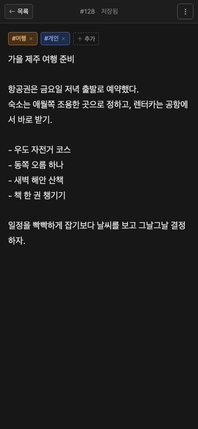

# Issue Note

GitHub Issues를 데이터 저장소로 사용하는 서버 없는 Svelte 노트 앱입니다.

**데모:** [note.gitools.net](https://note.gitools.net)

## 화면

### 데스크톱


### 모바일

<p align="center">
  
</p>

## 시작하기

```bash
npm install
npm run dev
```

GitHub에서 fine-grained personal access token을 만들고 다음 권한만 부여하세요.

- Repository access: 노트 저장소 하나
- Issues: Read and write
- Metadata: Read
- Contents: Read and write (파일·클립보드 이미지 첨부를 사용할 때만)

PAT와 저장소 설정은 사용자의 브라우저에만 저장되며, API 요청은 브라우저에서
`api.github.com`으로 직접 전송됩니다.

## 첨부파일 저장 방식

첨부파일은 GitHub Issue 자체에 바이너리로 저장되지 않습니다. 실제 파일은 같은
저장소의 다음 경로에 저장됩니다.

```text
.issue-note-assets/issues/{이슈 번호}/{UUID}-{파일명}
```

파일 하나마다 해당 이슈에 전용 댓글 하나를 만들며, 댓글에는 이미지 미리보기
또는 파일 링크와 앱이 사용하는 메타데이터 마커가 들어갑니다.

```md


<!-- issue-note-attachment:... -->
```

따라서 앱에서는 첨부파일을 본문 위의 썸네일 목록과 이미지 뷰어로 볼 수 있고,
GitHub 이슈 페이지에서도 이미지 또는 파일 링크를 바로 확인할 수 있습니다.
이슈 본문에는 첨부 메타데이터를 섞지 않고 순수한 노트 내용만 저장합니다.

첨부 작업은 다음 순서로 처리됩니다.

- 추가: 저장소에 파일 생성 → 첨부 댓글 생성
- 댓글 생성 실패: 방금 만든 저장소 파일 삭제
- 삭제: 저장소 파일 삭제 → 연결된 첨부 댓글 삭제
- 복구: 이슈를 열 때 그 이슈의 파일 폴더와 첨부 댓글만 대조하여, 댓글 없는
  파일은 전용 댓글을 다시 만들고 파일 없는 전용 댓글은 제거

다른 이슈나 저장소 전체를 스캔하지 않습니다. 일반 댓글이 많아도 첨부 댓글을
누락하지 않도록 GitHub의 페이지 링크를 마지막까지 따라간 뒤 대조합니다. 첨부는
노트당 최대 30개, 파일 하나당 10MB로 제한합니다. 첨부 기능을 사용하려면 PAT에
Issues와 Contents의 Read and write 권한이 모두 필요합니다. `.issue-note-assets/`의 파일이나
`<!-- issue-note-attachment:... -->` 마커가 있는 댓글을 GitHub에서 직접 수정하면
앱의 첨부 연결이 깨질 수 있습니다.

편집 내용은 1초 간격으로 브라우저의 로컬 초안에 저장되고, 마지막 입력 후
5초가 지나면 GitHub Issue에 자동 저장됩니다. 기본 설정에서는 본문의 첫 줄을
trim한 뒤 앞 50자를 이슈 제목으로 사용합니다. 연결 설정에서 별도 제목 입력,
글꼴, 글자 크기와 줄간격을 변경할 수 있습니다.

GitHub 라벨은 별도 접두어 없이 노트의 태그로 사용합니다. 편집기에서 태그를
추가하거나 제거할 수 있습니다. 태그 추가 메뉴에서는 기존 라벨을 검색해 바로
적용하거나 새 태그를 만들 수 있습니다. 목록의 태그를 누르면 해당 라벨이 붙은
노트만 볼 수 있습니다.

열려 있는 목록은 한 시간마다 백그라운드에서 다시 확인하여 새 이슈를 반영합니다.

## PWA

프로덕션 빌드는 설치 가능한 PWA로 동작합니다. 매니페스트와 서비스 워커는 특정
도메인이나 호스팅 서비스에 종속되지 않으며, 앱이 배포된 상대 경로를 기준으로
동작합니다. 서비스 워커는 앱과 같은 출처의 정적 파일만 캐시하고 GitHub API
요청, PAT, 노트 데이터는 캐시하지 않습니다.

## 빌드

```bash
npm run build
```

`dist/` 폴더를 GitHub Pages나 다른 정적 호스팅에 배포할 수 있습니다.

## 테스트

```bash
npm test
```

개발 중에 테스트를 계속 실행하려면 `npm run test:watch`, Svelte 정적
검사는 `npm run check`를 사용합니다. `main` 푸시와 pull request에서는 GitHub
Actions가 정적 검사, 테스트, 빌드를 자동으로 실행합니다.

## 라이선스

[MIT License](LICENSE)
